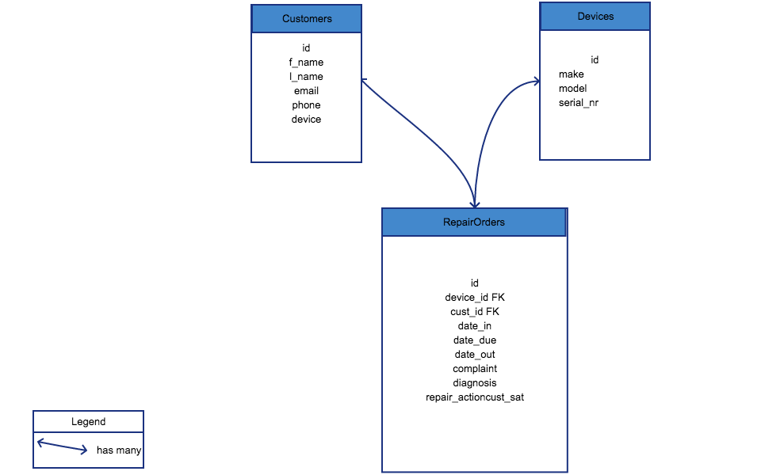

# 	Full Stack Project Backend

###  Overview:

Given only a template for the Rails enviroment, create both a custom backend server to handle **RESTful** requests from the custom frontend client. Host deploy the backend server using Heroku and the frontend client using GitHub pages.

### My Thoughts
The backend was relativly simple as most was of the work was done using the scaffolding command.

### ERD 

### My Challenged

The one thing that I struggled with on the back end was figuring out how to reduce the devices#index method to respond only with the devices that belong to the current_user.
I was able to accomplish this in the `rails console`, just not on the actual device_controller. 
With more practice using rub, I am more than sure I can learn how to accomplish said task and much more.

### Final Thoughts

I had a lot of fun using Ruby on Rails and look forward to using it in future projects.